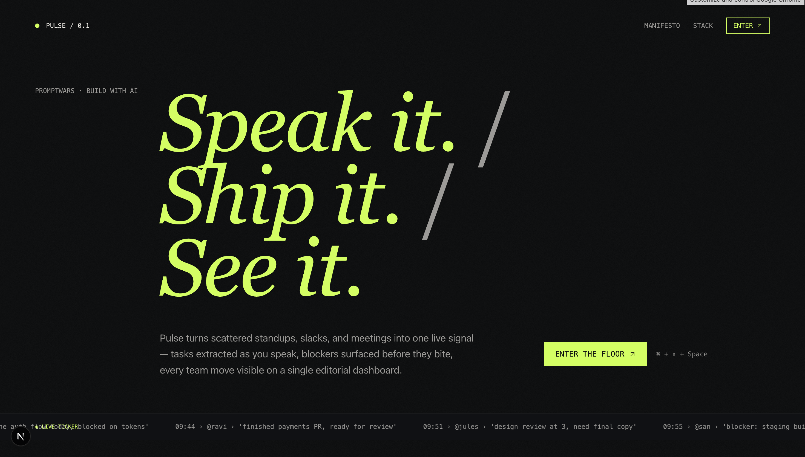
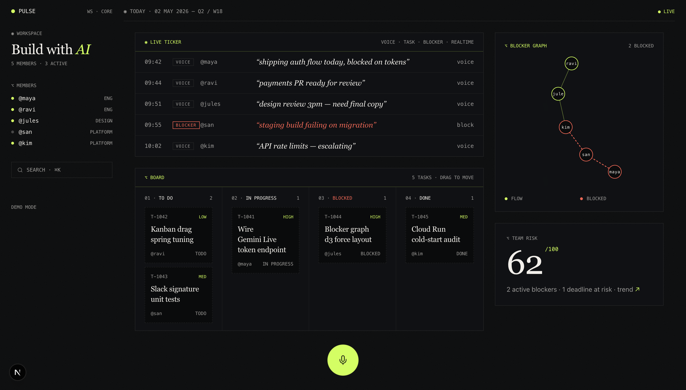
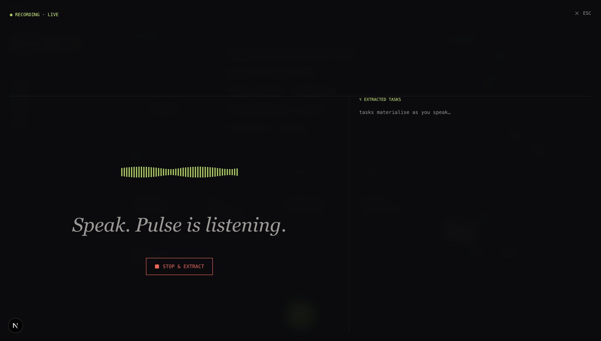

# Pulse

**Speak it. Ship it. See it.**

> ⚡ *I battled the 1 Mbps speed in the age of AI at IITM Research Park, Raman Hall, to ship this :,)*

> **PromptWars Chennai** — AI team collaboration platform. Voice-first standups → auto-extracted tasks → live blocker graph.

[](https://ai.google.dev)
[](https://firebase.google.com)
[](https://fastapi.tiangolo.com)
[](https://nextjs.org)
[](https://cloud.google.com/run)
[](https://promptwars.io)

> Tap the mic. Speak your standup.
>
> Gemini hears "blocked on staging build" and flags a blocker — before you finish the sentence.
>
> Tasks materialise on the Kanban. The team's pulse streams across the ticker. Coral edges on the graph mean someone needs help.
>
> You talk. Pulse does the rest.

<p align="center">
  
</p>

---

## Table of Contents

- [What is Pulse?](#what-is-pulse)
- [How It Works](#how-it-works)
- [Key Features](#key-features)
- [Tech Stack](#tech-stack)
- [Screenshots](#screenshots)
- [Running Locally](#running-locally)
- [Deploy](#deploy)
- [What's Next](#whats-next)
- [License](#license)

---

## What is Pulse?

Pulse replaces the daily standup, the missed Slack threads, and the post-meeting "who owns what."

You press a mic button and speak your update — the same way you'd talk to a teammate. Gemini Live transcribes it in real time. Gemini Flash extracts tasks (assignee, priority, deadline) and auto-flags blockers the moment it hears words like *"stuck"* or *"waiting on."* The extracted cards drop straight onto a shared live Kanban.

A real-time ticker scrolls every teammate's voice update across the bottom of the dashboard — the whole team's pulse in one glance, no refresh needed. A d3 force graph visualises who is blocked on whom: coral edges mean trouble, and the blocked person gets pinged automatically.

Tasks export to Google Calendar with one tap. The entire UI is accessible — WCAG 2.2 AA, aria-live ticker, reduced-motion support, 14.8:1 contrast ratio on the lime accent.

**Speak it. Ship it. See it.**

---

## How It Works

**1. Sign In** — Google Sign-In via Firebase Auth. Demo mode skips the auth wall — open and go.

**2. Hit the Mic Orb** — The breathing lime orb at the bottom-centre of the dashboard (or `⌘ + ⇧ + Space`). Speak your standup update the way you'd say it to a teammate.

**3. Gemini Extracts** — Hit **Stop & Extract**. Gemini Flash processes the transcript and returns structured tasks (assignee, priority, confidence score) and blockers (auto-detected from language like *"blocked on," "waiting on," "stuck"*). Cards materialise on the Kanban rail.

**4. Live Ticker** — Every voice update from every team member streams across the ticker bar in real time — Firestore-backed, sub-second latency. The whole team sees each other's updates without a page reload.

**5. Blocker Graph** — A d3 force-directed graph on the right panel shows dependency relationships between team members. Coral edges pulse when someone is blocked. The blocked person receives an in-app ping.

**6. Calendar Export** — Click any task card's calendar icon. The task lands in Google Calendar with date, assignee, and priority pre-filled.

---

## Key Features

| Feature | Description |
|---------|-------------|
| **Voice Standup** | Gemini Live captures your spoken update; live captions appear as you speak |
| **Task Extraction** | Gemini Flash extracts tasks with assignee, priority, deadline, and confidence score |
| **Live Ticker** | Every team voice update streams across the dashboard in real time via Firestore |
| **Blocker Graph** | d3 force layout — coral edges flag blocked relationships, auto-pings the owner |
| **Kanban Board** | Drag cards across columns (rotates 2-3°, glows lime on drop) |
| **Calendar Export** | Assigned tasks push to Google Calendar with one click |
| **Risk Score** | A single Fraunces number summarising team health at a glance |
| **Security** | HMAC-verified Slack signatures, PII redaction, Firestore rules, no API keys in browser |
| **Accessibility** | WCAG 2.2 AA — skip link, focus rings, aria-live ticker, role="alert" blockers, reduced motion |
| **Google Services (14)** | Gemini 3 Pro · Flash · Live · Firebase Auth · Firestore · Cloud Storage · Cloud Run · Cloud Build · Cloud Tasks · Secret Manager · Cloud KMS · Cloud Logging · Calendar API · Firebase Hosting |

---

## Tech Stack

| Category | Technology |
|----------|-----------|
| **Frontend** | Next.js 16 (App Router) + TypeScript + Tailwind + shadcn/ui |
| **Backend** | FastAPI + Python 3.12 + uv + Pydantic v2 |
| **AI** | Gemini 3 Pro / Flash / Live (`google-genai` SDK) |
| **Realtime / DB** | Firestore |
| **Auth** | Firebase Auth (Google Sign-In) |
| **Fonts** | Fraunces + General Sans + JetBrains Mono |
| **Testing** | pytest · Vitest · Playwright + AxeBuilder |
| **Deploy** | Cloud Run (backend) + Firebase Hosting (frontend) |

---

## Screenshots

**Home — The Pulse Dashboard**
<p align="center">
  
</p>

**Workspace — Kanban + Blocker Graph**
<p align="center">
  
</p>

**Voice Standup — Live Extraction**
<p align="center">
  
</p>

---

## Running Locally

```bash
# Clone
git clone https://github.com/padmanabhan-r/TeamColab
cd TeamColab
```

**Backend (FastAPI)**
```bash
cd backend
uv sync
uv run uvicorn app.main:app --reload
# Runs on http://localhost:8080
```

**Frontend (Next.js)**
```bash
cd frontend
pnpm install
pnpm dev
# Runs on http://localhost:3000
```

> Copy `backend/.env.example` → `backend/.env` and fill in your GCP project ID, Gemini API key, and Firebase credentials before starting.

---

## Deploy

### Quick deploy (demo mode)

**Backend → Cloud Run:**
```bash
gcloud run deploy pulse-api \
  --source backend \
  --region us-central1 \
  --allow-unauthenticated \
  --port 8080 \
  --memory 512Mi --cpu 1 --concurrency 80 \
  --min-instances 0 --max-instances 5 \
  --set-env-vars "ENV=demo,GCP_PROJECT=$(gcloud config get-value project),CORS_ORIGINS=[\"*\"]"
```

**Frontend → Cloud Run:**
```bash
BACKEND_URL=$(gcloud run services describe pulse-api --region us-central1 --format='value(status.url)')
cat > frontend/.env.production <<EOF
NEXT_PUBLIC_API_BASE=${BACKEND_URL}
NEXT_PUBLIC_WS_BASE=${BACKEND_URL/https/wss}
EOF
gcloud run deploy pulse-web \
  --source frontend \
  --region us-central1 \
  --allow-unauthenticated \
  --port 8080 \
  --memory 256Mi --cpu 1
```

### Full CI/CD pipeline
```bash
gcloud builds submit --config infra/cloudbuild.yaml
```

---

## What's Next

Pulse launched as a hackathon project — the foundation is solid, and there's a lot more to build.

| Incoming | Description |
|----------|-------------|
| **Slack Integration** | Two-way Slack sync — passive Events API listener extracts tasks from opted-in channel chat; outbound webhooks post blocker pings and daily digests back to the channel |
| **Smart Digest** | Auto-generated end-of-day standup digest emailed to the whole team — no one misses context |
| **AI Suggestions** | Gemini surfaces task reassignments and priority adjustments based on blocker patterns |
| **Multi-workspace** | Organisation-level accounts with project workspaces and role-based access |
| **Mobile PWA** | Full standup flow from the phone — mic orb, ticker, and graph on a responsive layout |

---

## License

<p>
  <a href="https://opensource.org/licenses/MIT">
    
  </a>
</p>

This project is licensed under the [MIT License](LICENSE).

---

<p align="center">
  <i>Powered by Gemini &nbsp;|&nbsp; Built for PromptWars Chennai at IITM Research Park</i><br/>
  <i>Speak it. Ship it. See it.</i>
</p>
